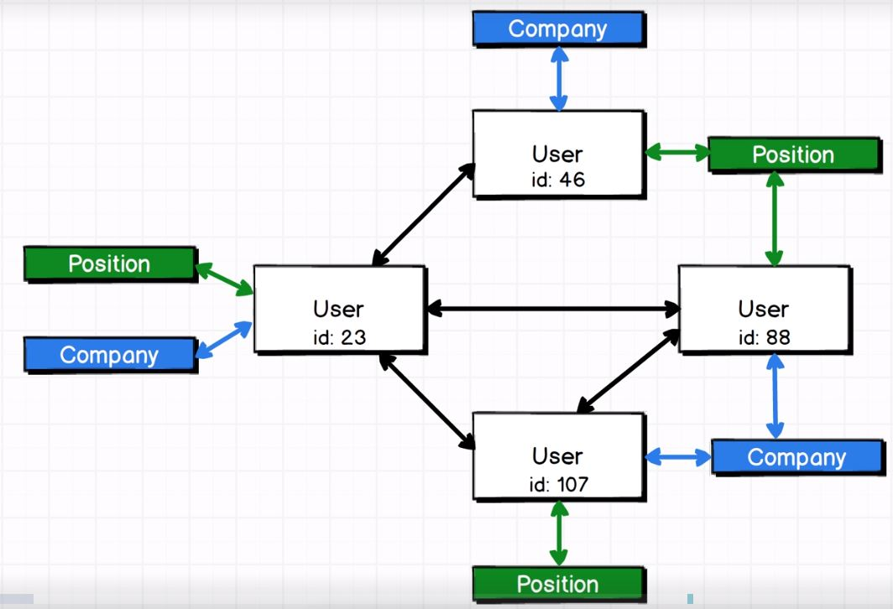
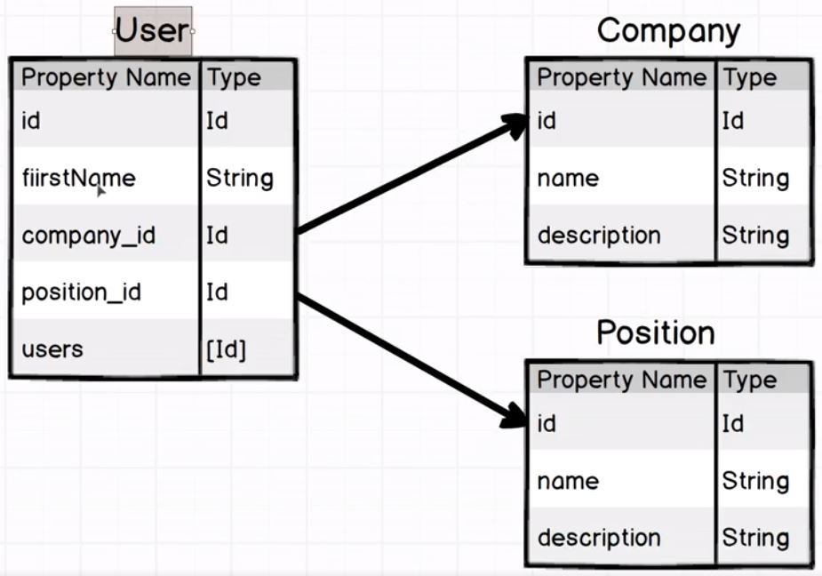
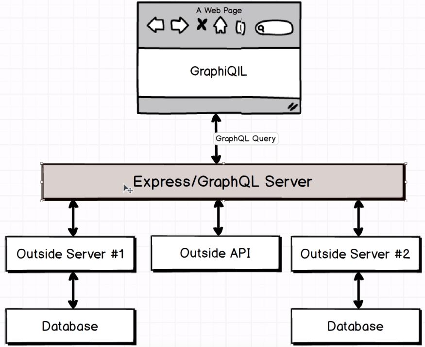

# General informations

**Graph** - represents nodes and relations between these nodes. Gdy mamy nasze modele (np. użytkownicy o różnych *id*) oraz *graph*, wtedy możemy wykonywać query do nich.

## Pierwszy projekt - [Users](https://github.com/kamiljozwik/GraphQLCasts/tree/master/users)

Projekt zawiera express + datastore (baza danych).

Paczki npm: `express`, `express_graphql` (komunikacja między graphQL a express) oraz `graphql`.

### Server

W repo w pliku `server.js` konfiguracja serwera _express_. Express server sprawdza, czy zapytanie jest typu graphQL, jeżeli nie, to nic nie robi. Jeżeli dla graphQL, wtedy przekazuje zapytanie do graphQL.

### Schema

Folder _schema_ zawiera schema, czyli informację o tym, jakie są relacje w naszej bazie danych pomiędzy rekordami. Cała wiedza na temat naszej bazy danych, którą przekazujemy do GraphQL - najważniejsze jakie properties ma każdy object i w jaki sposób nasze obiekty są ze sobą powiązane (relations). W pliku _schema.js_ znajduje się schema dla następującej sytuacji w bazie danych (User'rzy są przyjaciółmi i każdy ma jakąś pracę i pozycję, będzimy odpytywali o te dane)



Natomiast tak wyglądają properties:



#### Plik schema.js

W pliku znajdują się komentarze wyjaśniające poszczególne sekcje pliku.

RootQuery - pierwszy obiekt naszego _graph_. Od niego zaczynamy nasze query z wykorzystaniem GraphQL - w przykładowej aplikacji będzie to User o id: 23.

Funkcja _resolve_:  tutaj idziemy do naszej bazy danych i szukamy rzeczywistej danej (tu: user o konkretnym id).

- Parametr _parentValue_ - rzadko używany.
- Parametr _args_ (obiekt) - wszystko, co podany do rzeczywistej query w bazie danych, czyli jeżeli nasze rzeczywiste query is expected to be provided with id of the user we are going to fetch, that id will be presents on this _args_ object.

### GraphiQL Tool

Narzędzie dostarczone razem z GraphQL do testowania queries w naszej aplikacji. Dostępne jako środowisko graficzne w przeglądarce. Jak uruchomić, pokazane w pliku _server.js_. Gdy klikniemy w Docs w tym narzędziu, dostaniemy dokumentację która tworzy się automatycznie z naszego pliku _schema.js_. GraphQL queries wyglądają jak obiekty. Przykłądowe query dla naszej aplikacji:

``` javascript
{
    user(id: "23") {
        id,
        firstName,
        age
    }
}
```

Powyższe query zwróci nam informacje o urzytkowniku z id:23. Query wygląda jak JavaScrip, ale to nie jest kod JavaScript. To query najpierw trafia do RootQuery z naszego pliku _schema.js_.

W odpowiedzi dostaniemy tylko te dane o które pytamy jako obiekt JS, czy tutaj będzie to _id, firstName, age_.

Jeżeli w query podamy id użytkownika, który nie istanieje, dostaniem w odpowiedzi _null_, natomiast jeżeli w ogóle nie podamy _id_, dostaniemy error, ponieważ w naszej RootQuery podaliśmy w _args_ informację o tym, że wymagamy _id_ o typie _string_.

### Database

W przypadku gdy mamy dość rozbudowaną aplikację, która korzysta z kilku serwerów, różnych baz danych i api, GraphQL może służyć nam jako proxy do nich wszystkich



W przypadku tego projektu dane będziemy pobierać z fake'owego serwera API stworzonego przy pomocy narzędzia [JSON Server](https://github.com/typicode/json-server). W _package.json_ dodajemy may skrypt, aby uruchamiać fake server.
W pliku _db.json_ znajdują się dane, które są serwowane przez fake API server.

W aplikacji korzystamy z _axios_, który zwraca nam obiekt z property _data_ i w tym property znajduje się rzeczywista odpowiedź z serwera API. Musimy więc w _.then_ zwrócić _resp.data_, aby dobrze to działało z GraphQL. 

Ponieważ funkcja resolve can handle a promise, we can reach data from almost anywhere.

Mały tip: używać nodemon, aby samodzielne restartował nam _server.js_ gdy zapiszemy zmiany w jakimkolwiek pliku. W pliku _package.json_ mały skryp do uruchomienia nodemon'a.

