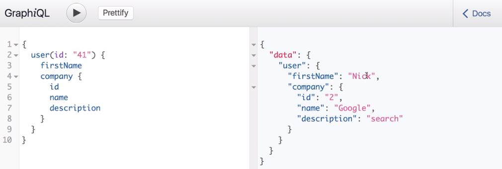
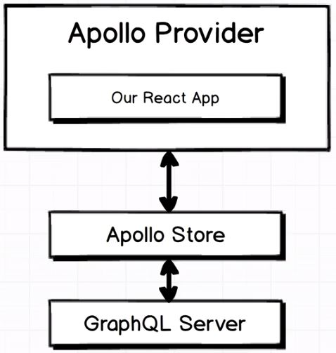
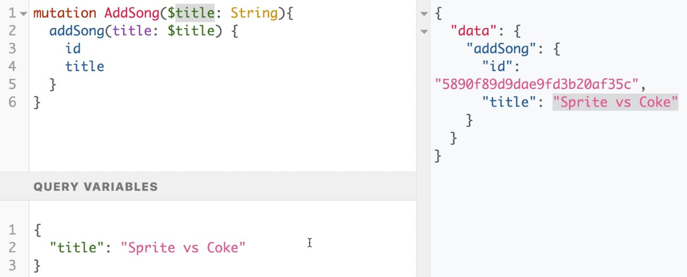
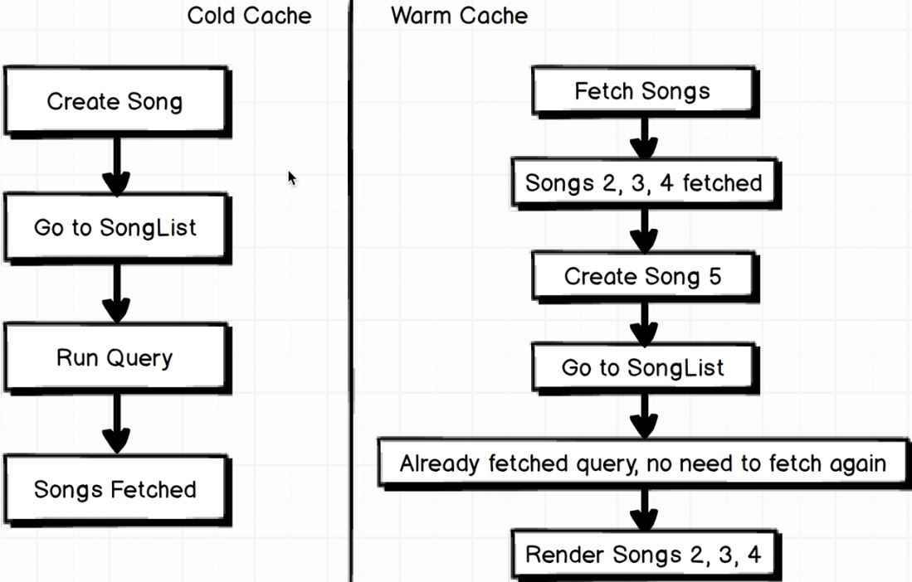

# General informations

**Graph** - represents nodes and relations between these nodes. Gdy mamy nasze modele (np. użytkownicy o różnych *id*) oraz *graph*, wtedy możemy wykonywać query do nich.

## Pierwszy projekt - [Users](https://github.com/kamiljozwik/GraphQLCasts/tree/master/users)

Projekt zawiera express + datastore (baza danych).

Paczki npm: `express`, `express_graphql` (komunikacja między graphQL a express) oraz `graphql`.

### Server

W repo w pliku `server.js` konfiguracja serwera _express_. Express server sprawdza, czy zapytanie jest typu graphQL, jeżeli nie, to nic nie robi. Jeżeli dla graphQL, wtedy przekazuje zapytanie do graphQL.

### Schema

Folder _schema_ zawiera schema, czyli informację o tym, jakie są relacje w naszej bazie danych pomiędzy rekordami. Cała wiedza na temat naszej bazy danych, którą przekazujemy do GraphQL - najważniejsze jakie properties ma każdy object i w jaki sposób nasze obiekty są ze sobą powiązane (relations). W pliku _schema.js_ znajduje się schema dla następującej sytuacji w bazie danych (User'rzy są przyjaciółmi i każdy ma jakąś pracę i pozycję, będzimy odpytywali o te dane)


Natomiast tak wyglądają properties:


#### Plik schema.js

W pliku znajdują się komentarze wyjaśniające poszczególne sekcje pliku.

RootQuery - pierwszy obiekt naszego _graph_. Od niego zaczynamy nasze query z wykorzystaniem GraphQL - w przykładowej aplikacji będzie to User o id: 23.

Funkcja _resolve_:  tutaj idziemy do naszej bazy danych i szukamy rzeczywistej danej (tu: user o konkretnym id).

- Parametr _parentValue_ - rzadko używany w rootQuery
- Parametr _args_ (obiekt) - wszystko, co podany do rzeczywistej query w bazie danych, czyli jeżeli nasze rzeczywiste query is expected to be provided with id of the user we are going to fetch, that id will be presents on this _args_ object.

### GraphiQL Tool

Narzędzie dostarczone razem z GraphQL do testowania queries w naszej aplikacji. Dostępne jako środowisko graficzne w przeglądarce. Jak uruchomić, pokazane w pliku _server.js_. Gdy klikniemy w Docs w tym narzędziu, dostaniemy dokumentację która tworzy się automatycznie z naszego pliku _schema.js_. GraphQL queries wyglądają jak obiekty. Przykłądowe query dla naszej aplikacji:

``` javascript
{
    user(id: "23") {
        id,
        firstName,
        age
    }
}
```

Powyższe query zwróci nam informacje o urzytkowniku z id:23. Query wygląda jak JavaScrip, ale to nie jest kod JavaScript. To query najpierw trafia do RootQuery z naszego pliku _schema.js_.

W odpowiedzi dostaniemy tylko te dane o które pytamy jako obiekt JS, czy tutaj będzie to _id, firstName, age_.

Jeżeli w query podamy id użytkownika, który nie istanieje, dostaniem w odpowiedzi _null_, natomiast jeżeli w ogóle nie podamy _id_, dostaniemy error, ponieważ w naszej RootQuery podaliśmy w _args_ informację o tym, że wymagamy _id_ o typie _string_.

### Database

W przypadku gdy mamy dość rozbudowaną aplikację, która korzysta z kilku serwerów, różnych baz danych i api, GraphQL może służyć nam jako proxy do nich wszystkich


W przypadku tego projektu dane będziemy pobierać z fake'owego serwera API stworzonego przy pomocy narzędzia [JSON Server](https://github.com/typicode/json-server). W _package.json_ dodajemy may skrypt, aby uruchamiać fake server.
W pliku _db.json_ znajdują się dane, które są serwowane przez fake API server.

W aplikacji korzystamy z _axios_, który zwraca nam obiekt z property _data_ i w tym property znajduje się rzeczywista odpowiedź z serwera API. Musimy więc w _.then_ zwrócić _resp.data_, aby dobrze to działało z GraphQL.

Ponieważ funkcja resolve can handle a promise, we can reach data from almost anywhere.

Mały tip: używać nodemon, aby samodzielne restartował nam _server.js_ gdy zapiszemy zmiany w jakimkolwiek pliku. W pliku _package.json_ mały skryp do uruchomienia nodemon'a.

### Relations

W pliku _schema.js_ podajemy relacje między naszymi obiektami - czyli np. relację między User'em a Company. Tak to wygląda na grafice:


W pliku _schema.js_ jako jeden z _fields_ ustawiamy _company_ (linia 34). Jest to jednak nazwa niż propert rzeczywistego zwracanego rekordu - tam mamy companyId (jak widać na obrazku wyżej). Sytuacja zobrazowana poniżej - po lewej stronie rzeczywisty zwracany rekord z API (mongodb model), natomiast po prawej UserType z pliku _schema.js_. W takim przypadku musimy stworzyć funkcję _resolve_, która dla nas tym się zajmie:


Teraz jednak użyjemy argumentu _parentValue_ funkcji _resolve_. Gdy nasze query będzie wyglądało następująco:

``` javascript
{
    user(id: "23") {
        id,
        company {
            id
        }
    }
}
```

pod argumentem _parentValue_ będziemy mieli wszystko zwrócone z bazy danych na temat User'a, również _companyId_. Argument _args_ jest pustym obiektem. Możemy użyć _companyId_ aby odpytać bazę danych o tą właśnie Company (linia 37). _ParentValue_ jest informacją o rekordzie z którego przyszło zapytanie poprzez funkcję _resolve_. Teraz nasze query będzie zwracało również informację o Company naszego Usera:



Graficzn przedstawienie jak nasze query wygląda w tym momencie - Przez funkcję resolve dla RootQuey znajdujemy User'a a następnie przez relację i kolejną funkcję resolve (należącą do User'a) znajdujemy informację na temat jego Company. Można stwierdzić, iż funkcje _resolve_ przenoszą nas w inne miejsce na grafie.


Bardziej złożona prezentacja tego co tak naprawdę robi i do czego służy funkcja _resolve_:


### Multiple RootQuery Entry Points

Do tej pory nasze RootQuery pozawalało tylko dostać się do User'a i dopiero z niego dostać dane o Company. Nie mogliśmy zapytać bezpośrednio o dane dowolnej Company. Aby mieć dostęp również do takiej funkcjonalności, w pliku _schema.js_ dodajemy kolejny _fields_ dla RootQuery o nazwie _company_ (linia 55).

### Bidirectional Relations

Sytuacja, w której chcemy wykonać query w którym zapytamy o Company i w odpowiedzi będziemy chcieli dostać listę User'ów należących do tej Company (mających relację z Company). Do tej pory mamy możliwość z RootQuery dostać się do User'a i Company, oraz z User'a dostać się do Company, ale nie na odwrót.

Będąc zgodnym ze standardami REST API, w naszym fake serverze serwującym JSONy, możemy otrzymać listę wszystkich userów danej Company używajac zapytania `localhost:3000/companies/2/users` - JSON server z którego korzystamy poradzi sobie z tym zapytaniem, ponieważ w pliku _db.js_ mamy odpowiednie pola _id_ łączące User'a z Company.

Ponieważ chcemy przejść z Company do Users, w pliku _schema.js_ w typie _CompanyType_ dodajemy nowy _fields_ o nazwie _users_ (linia 18). Tam ponownie definiujemy funkcję _reolve_, która wykona to samo co podane wyżej zapytanie - `localhost:3000/companies/2/users`. _parentValue_ is now current company that we already fetched and we are currently working with.

> Uwaga1: tutaj jako typ dla _users_ podajemy listę, w której każdy element będzie takiego samego typu jak pojedynczy User.

> Uwaga2: _UserType_ oraz _CompanyType_ posiadają property fields zdefiniowane jako arrow function, która zwraca obiekt. Jest to zrobione w ten sposób, ponieważ te stałe zależą od siebie - w UserType odnosimy się do CompanyType i odwrotnie, co powoduje, że chcemy w pewnym momencie użyć zmiennej, która nie została jeszcze zdefiniowana. Użycie arrow function i zwrócenie obiektu powoduje stworzenie _closure_ na tych zmiennych i uruchomi nam kod bez błędów związanych z niedefiniowaną zmienną/stałą.

Teraz możemy odpytywać o Company oraz o należących do niej User'ów a także zagnieżdzać kolejne query (dzięki funkcjom _resolve_):


### Query Fragments

Przydatne rzeczy do formułowania queries:

- możemy nazywać nasze query (przydatne, gdy na froncie mamy wiele GraphQL queries i używamy w kilku miejscach):

``` javascript
query findCompany {
    comapny(id: "1") {
        id
        name
        description
    }
}
```

- w jednym zapytanie możemy zapytać o tą samą rzecz (która jest zdefiniowana w RootQuery) kilka razy, w naszym przypadku np. o Company. Jednak w jednym zapytanie nie możemy mieć dwa razy tego samego key - nie możemy np. zapytać tak:

``` javascript
{
    comapny(id: "1") {
        id
        name
        description
    }
    comapny(id: "2") {
        id
        name
        description
    }
}
```

ponieważ mamy zdublowaną wartość _company_, mimo, że pytamy o inne _id_. Możemy jednak przypisać każdemy z "subqueries" nazwę, pod którą będzie dostępny rezultat zapytania:

``` javascript
{
    apple: comapny(id: "1") {
        id
        name
        description
    }
    google: comapny(id: "2") {
        id
        name
        description
    }
}
```

Teraz wszystko będzie działało ok i w odpowiedzi na query nie będziemy mieli _key_ "company", tylko "apple" oraz "google":

``` javascript
{
    "data": {
        "apple": {/* informacje */},
        "google" :{/* informacje */}
    }
}
```

- _Query Fragments_ - pozwala nam na uniknięcie duplikatów w query -> w query powyżej w dwóch miejscach mamy _id, name, description_. Chcemy tego uniknąć i mieć to tylko raz zdefiniowane i dwukrotnie użyte. Definicja _Query Fragment_

``` javascript
{
    apple: comapny(id: "1") {
        ...companyDetails
    }
    google: comapny(id: "2") {
        ...companyDetails
    }
}

fragment companyDetails on Company {
    id
    name
    description
}
```

_on Company_ to swego rodzaju _type checking_ wykonywany przez GraphQL, aby sprawdzić, czy te properties rzeczywiście należą do typu Company.

### Modify data on server - Mutations

> Info: REST server stworzony przez JSON Server posiada możliwość zmiany danych (mutacji danych) poprzez POST, PUT, DELETE requests

_Mutation_ w GraphQL jest odpowiednikiem _RootQuery_. W _RootQuery_ definiujemy o co możemy zapytać nasz serwer, natomiast w _Mutations_ definiujemy co możemy zrobić z naszymi rekordami (dodać, usunąć, itp.). (linia 66). W _fields_ dla _mutations_ mamy również _type, args_ oraz funkcję _resolve_

Wywołanie _mutation_ delkatnie się różni od dotychczasowych zapytań - dodajemy słowo _mutation_:


po _addUser_ podajemy jakie informacje chcemy zobaczyć po stworzeniu User'a. JSON server po stworzeniu rekordu odpowiada obiektem zawierającym dane tego rekordu.

W przypadku _deleteUser_, również musimy podać jakie informacje chcemy otrzymać z bazy danych po usunięciu rekordu - JSON server po usunięciu rekordu nie zwraca danych o usuniętym rekordzie, więc możemy mieć `"id": null` w odpowiedzi na nasze delete query.

W przypadku update'owania rekordu możemy użyć PUT albo PATCH. PUT najpierw usuwa stary rekord i na jego miejsce wstawia nowy (zachowując id) natomiast PATCH tylko aktualizuje rekord o dane które ma w request body:


Przykad Query dla update:


## Drugi Projekt - [Lyrical](https://github.com/kamiljozwik/GraphQLCasts/tree/master/Lyrical-GraphQL)

Projekt uwzględniający pracę z GraphQL na froncie - nie będzie nic robione na back-endzie. Na froncie aplikacja będzie wspierana przez ReactJS. W folderze _server_ znajduje się (już gotowy) nasz GraphQL backend. Pliki ze schema podzielone na mniejsze moduły.

Na backendzie mamy GraphQL + Express + MongoDB (hostowany na [MongoLab](https://www.mlab.com)).

W skrócie, w aplikacji tworzymy piosenki,a po otworzeniu każdej piosenki mamy jej tekst. Możemy dodawać tekst do tej piosenki - wiersz po wierszu. Możemy również "like'ować" pojedyncze wiersze dowolnej piosenki.

Backend ustawiony tak, aby mieć dostęp do narzędzia GraphiQL. Tam klikając _Docs_ mamy zawsze automatycznie wygenerowaną dokumentację naszego backendu (na podstawie plików schema) - będą tam RootQueries, relacje oraz mutations. Na podstawie tych danych można tworzyć queries w panelu GraphiQL. Dane teraz zapisywane w MongoDB.

### Client Side (Front)

Schemat architektury aplikacji:



**Apollo Store** - (nazywane też: Apollo Client) komunikuje się bezpośrednio z serwerem GraphQL oraz przechowuje dane zwrócone przez ten serwer. Przechowuje wszystkie dane, które są dostępne na froncie aplikacji. Niezależne od frameworka jaki mamy na froncie.

**Apollo Provider** - provider of data for React application. SPecyficzny dla danego frameworka. Bierze dane z Apollo Store i wstrzykuje do React'a. Tutaj najwięcej konfiguracji.

Apollo Client'a i Apollo Provider definiujemy w pliku _client/index.js_. W plikach komentarze opisujące poszególne linie kodu.

_Checklist_ dla GraphQL + React, dzięki której będziemy mieli dane z servera GraphQL w komponentach React'a:

- Identify data required (wskazanie dokładnie jakie dane będziemy potrzebowali z serwera)
- Write query in Graphiql (for practice) and in component file
- Bond query + component
- Access data!

>Tip: w checkliscie nie ma informacji mówiącej o tym, aby sprawdzać, czy nasze query na pewno się wykonało - Apollo i GraphQL zajmuje się tym za nas.

GraphQL queries wykonujemy przy pomocy bibiloteki `graphql-tag`. Importujemy ją w komponencie jako _gql_ (ogólna konwencja). Następnie nasze query wyglądają następująco (tylko definicja query - nie wykonanie):

``` javascript
// Używamy template strings (backticks)
const query = gql`
  {
    songs {
      id
      title
    }
  }
`;
```

W repo aplikacji query zostały przeniesione do osobnego pliku i następnie są importowane w komponencie.

W linii 58 komponentu _SongList.js_, przy eksportowaniu komponentu, łączymy go z danymi GraphQL. Komponent w pierwszej kolejności renderuje się i pojawia się na stronie, następnie odpalane jest (są) query i gdy query się wykona i dostępne będą dane z serwera, komponent re-renderuje się z załadowanymi danymi. Dane są teraz dostępne w `this.props.data` komponentu. `.data` na propsach tworzone rpzez _graphql_ helper.

Z tego powodu musimy poradzić sobie z czasem, gdy dane są ładowane, ponieważ wtedy pod `this.props.data` nie mamy żadnych danych. Mamy za to property `this.props.data.loading`, która jest ustawiona na `true`, gdy dne są jeszcze pobierane i zmieni się na `false`, gdy dane zostaną załadowane do komponenu i komponent się przeładuje.

#### Mutations

**Dodawanie piosenki**

W linii 40 pliku _songCreate.js_ mmy przykład mutaions -> dodawanie piosenki. W komentarzach wyjaśniowe jak wygląda składnia mutation. 

Testując takie query w _GraphiQL_, możemy posłużyć się _Query Variables_. Są one dostępne w lewym dolnym rogu GraphiQL. Są to zmienne, które możemy zawrzeć w naszym query bądź mutation. Przykład mutation z GraphiQL i zmienną: 



Query variables definiujemy też w React, aby poprawnie pisać mutations w Componentach. Linia 17 w SongCreate.js

> Uwaga: częstym problemem w Apollo jest fakt, iż po wykonaniu mutation, nowy rekord nie pojawia się w komponencie. W przypadku naszej aplikacji, po wejściu na główną stronę (i wykonaniu query, które pobiera aktualną listę piosenek), kliknięciu dodaj piosenkę i następnie kliknięciu Enter (wykonaniu mutation), wracamy do głównego ekranu i nie widzimy nowo dodanego rekordu. Musimy wymusić przeładowanie strony. Dzieje się tak, ponieważ na samym początku pobraliśmy już listę wszystkich piosenek z bazy danych do głównego ekranu i Apollo nie zrobi tego drugi raz - tzw. _warm Cache_



Aby rozwiązać ten problem, w pliku _SongCreate.js_ dodana linia 19. 

**Usuwanie piosenki**

Usuwanie piosenki poprzez mutaion w pliku _SongList.js_. Podobnie jak przy dodawaniu, po usunięciu nie pobierają się ponownie piosenki z bazy i usunięta piosenka ciągle jest widoczna na stronie - w linii 10 pokazane jak w inny sposób wykonać ponownie pobranie danych po wykonaniu mutation. Możemy tutaj skorzystać z `this.props.data.refetch()`, ponieważ mamy dostęp do `this.props.data`, nie w każdym komponencie będzie tak łatwo. Przy tworzeniu piosenki nie możemy skorzystać z tej opcji. 

#### Fetching individual records

Pobieranie pojedynczych rekordów (zamiast całej listy) wykonujemy podobnie jak dodawanie i usuwanie reordów - potrzebujemy query variable, która będzie _id_ recordu który chcemy pobrać. W naszej aplikacji query pobierania jednego rekordu znajduje się w pliku _queries/fetchSong.js_. Query to jest importowane w komponencie _SongDetail.js_. 


#### React router with GraphQL

W komponencie _SongDetail_ mamy informację o jednej pojedynczej piosence. O tym, która jest to piosenka (jakie ma _id_) informuje nas React Router. Konfiguracja w pliku _index.js_ folderu client. Mamy tam route z path `path="songs/:id" `. id podawane jako props do komponentu: `props.params.id`. 

#### DataIdFromObject

DataIdFromObject jest dodatkową konfiguracją, którą możemy dodać podczas tworzenia klienta apollo. W naszym projekcie jest to w pliku `client/index.js`, linia 14. Dzięki temu, każda pobrana data z GraphQL będzie na froncie identyfikowana przez jej _id_. Nie jest to domyślne zachowanie, musimy to manualnie wpisać w konfiguracji Apollo. Musimy teraz zawsze w naszych query pobierać również _id_ (co i tak jest dobrą praktyką, bo możemy id używać później jako _key_ gdy mapujemy listy w komponentach). Dzięki temu podejściu, teraz za kazdym razem gdy zrobimy na froncie update rekordu i zostanie to wysłane do bazy danych, na froncie komponent Reactowy zostanie re-renderowany. W poprzednich przypadkach opisanych wcześniej (np. w SongCreate.js mamy `refetchQueries`) wymuszaliśmy na dwa różne sposoby jak re-renderować komponent używający query GraphQL, teraz dzięki tej linii konfiguracyjnej, będzie to robiło się automatycznie, bo Apollo wie jak rozpoznać i odnaleźć w Reakcie zaktualizowanr rekordy w Apollo Cliecie (właśnie poprzez przypisywanie im _id_). To zjawisko opisane dokładniej w docs Apollo [na tej stronie](https://www.apollographql.com/docs/react/features/caching.html)

#### Optymistics UI updates

W naszej aplikacji, gdy klikamy na przycisk "Like", mamy delikatne opóźnienie od czasu kliknięcia, do czasu odświeżenia aktualnej liczby like'ów. Optimistic updates umożliwiają usunięcie tego laga. Optimistic updates działa na zasadzie przewidywania tego jaka odpowiedź wróci do nas z serwera po wykonaniu query i obrazowanie jej na froncie, zanim ta odpowedź fizycznie wróci z backendu. Gdy wróci i jednak będzie inna niż przewidziana, wtedy ponownie mamy re-render elementu.

Optimistic updates zaimplementowane w _LyricList.js_ (linia 9).

## Trzeci Projekt - [Auth](https://github.com/kamiljozwik/GraphQLCasts/tree/master/auth-graphql-starter)